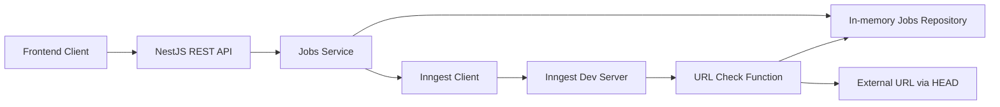
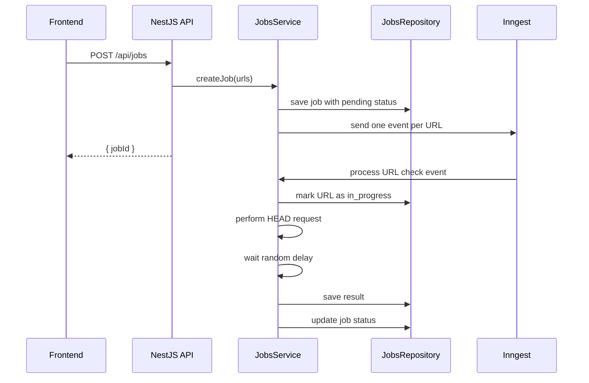
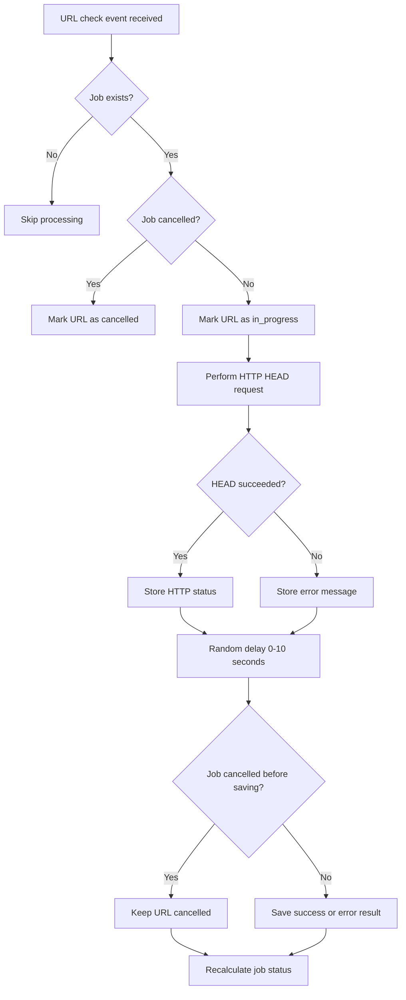
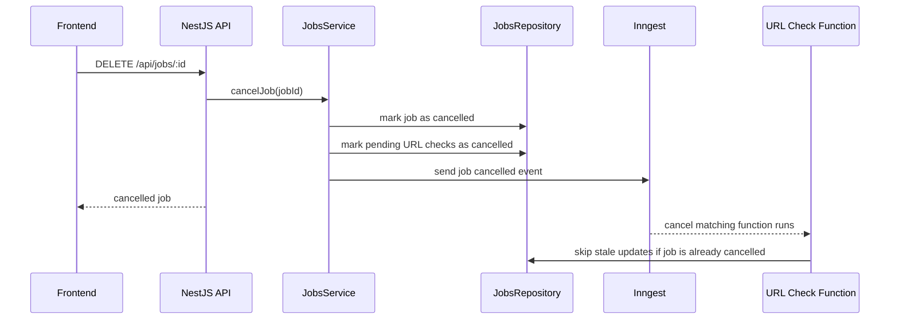
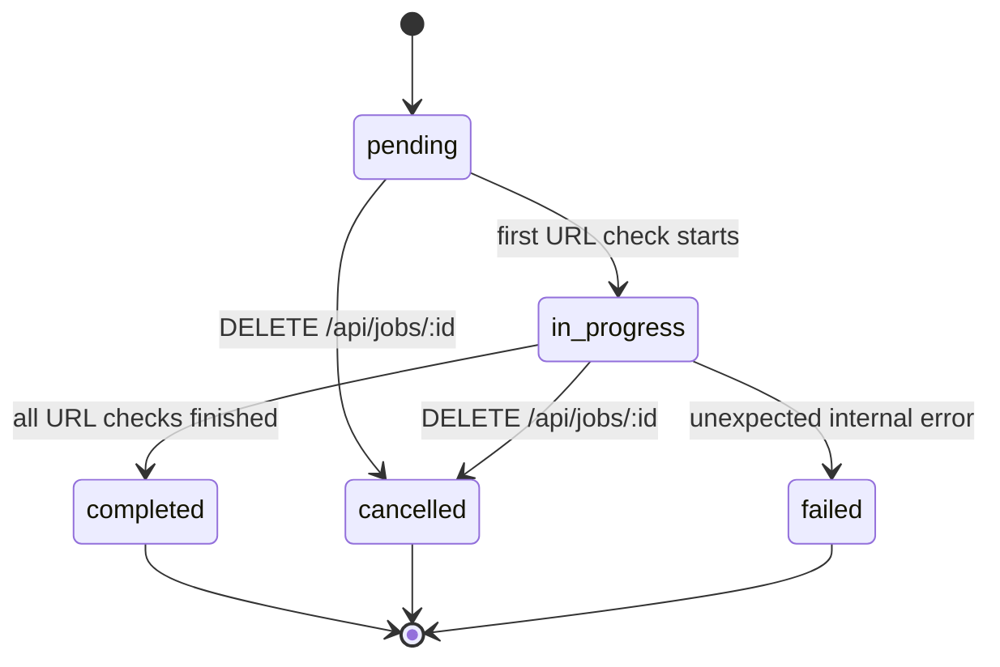
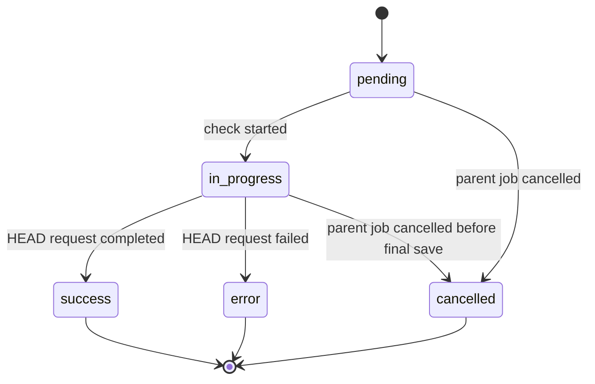

# Backend Architecture

## Overview

This backend implements an asynchronous URL checking service.

The API allows users to create URL check jobs, list existing jobs, view detailed job results, and cancel running jobs.

The backend is designed around a clear separation of responsibilities:

* REST API layer
* job lifecycle service
* in-memory repository
* background processing layer
* URL check execution

## High-Level Architecture

## Main Components

### Jobs Controller

The controller exposes the REST API endpoints:

* `POST /api/jobs`
* `GET /api/jobs`
* `GET /api/jobs/:id`
* `DELETE /api/jobs/:id`

The controller should stay thin and delegate business logic to `JobsService`.

### Jobs Service

The service owns the job lifecycle.

Responsibilities:

* create jobs
* validate incoming URLs
* send URL check events to Inngest
* return job summaries
* return job details
* cancel jobs
* update job and URL statuses
* recalculate parent job status after URL result changes

### Jobs Repository

The repository is an in-memory storage abstraction based on `Map`.

It stores:

* job metadata
* URL check records
* job status
* URL check status
* timestamps
* HTTP status codes
* error messages
* duration values

The repository abstraction keeps storage details outside the controller and background functions.

### Inngest Client

The Inngest client is used to publish background events.

When a job is created, the backend sends one event per URL. This creates a fan-out processing model where every URL check has its own background execution unit.

### URL Check Function

The URL check function is triggered by a URL check event.

Responsibilities:

1. Check whether the job exists.
2. Check whether the job has already been cancelled.
3. Mark the URL check as `in_progress`.
4. Perform an HTTP HEAD request.
5. Wait for a random artificial delay between 0 and 10 seconds.
6. Save the final URL result.
7. Recalculate the parent job status.

## Job Creation Flow

## URL Check Processing Flow

## Cancellation Flow

## Job State Machine

## URL Check State Machine

## Concurrency Model

Concurrency is limited per job.

Each URL check is triggered as a separate background event. The URL check function uses a concurrency key based on `jobId`.

This means:

* Job A can process up to 5 URLs at the same time.
* Job B can also process up to 5 URLs at the same time.
* Different jobs do not block each other.
* A single job never exceeds 5 active URL checks.

## Delay Model

Every URL check applies an artificial random delay before saving the final result.

The delay is applied after the HEAD request finishes and before the result is persisted.

This matches the task requirement that the artificial delay must happen before saving the result.

## Error Handling Model

A failed URL check does not mean that the whole job failed.

For example, if one URL returns a network error, this is stored as a URL-level `error` result.

The parent job becomes `completed` when all URL checks finish, even if some URL checks ended with `error`.

The parent job becomes `failed` only if an unexpected internal processing error happens.

## Storage Model

The project uses in-memory storage.

This means:

* data is lost after server restart
* no database migrations are needed
* the implementation stays focused on async processing logic

For a production version, the in-memory repository could be replaced with a persistent database.
