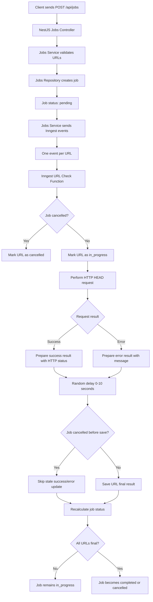

# Backend Flow Diagram

```mermaid
flowchart TD
  A["Client sends POST /api/jobs"] --> B["NestJS Jobs Controller"]
  B --> C["Jobs Service validates URLs"]
  C --> D["Jobs Repository creates job"]
  D --> E["Job status: pending"]
  E --> F["Jobs Service sends Inngest events"]

  F --> G["One event per URL"]
  G --> H["Inngest URL Check Function"]

  H --> I{"Job cancelled?"}
  I -- "Yes" --> J["Mark URL as cancelled"]
  I -- "No" --> K["Mark URL as in_progress"]

  K --> L["Perform HTTP HEAD request"]
  L --> M{"Request result"}

  M -- "Success" --> N["Prepare success result with HTTP status"]
  M -- "Error" --> O["Prepare error result with message"]

  N --> P["Random delay 0-10 seconds"]
  O --> P

  P --> Q{"Job cancelled before save?"}
  Q -- "Yes" --> R["Skip stale success/error update"]
  Q -- "No" --> S["Save URL final result"]

  R --> T["Recalculate job status"]
  S --> T

  T --> U{"All URLs final?"}
  U -- "No" --> V["Job remains in_progress"]
  U -- "Yes" --> W["Job becomes completed or cancelled"]
```