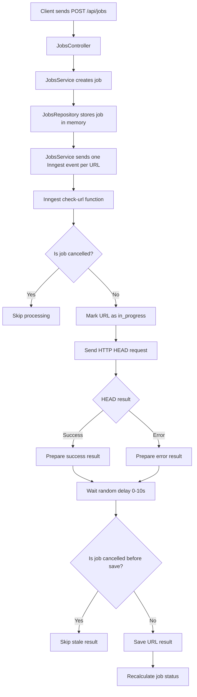

# Backend Flow

```mermaid
flowchart TD
  A["Client sends POST /api/jobs"] --> B["JobsController"]
  B --> C["JobsService creates job"]
  C --> D["JobsRepository stores job in memory"]
  D --> E["JobsService sends one Inngest event per URL"]

  E --> F["Inngest check-url function"]
  F --> G{"Is job cancelled?"}

  G -- "Yes" --> H["Skip processing"]
  G -- "No" --> I["Mark URL as in_progress"]

  I --> J["Send HTTP HEAD request"]
  J --> K{"HEAD result"}

  K -- "Success" --> L["Prepare success result"]
  K -- "Error" --> M["Prepare error result"]

  L --> N["Wait random delay 0-10s"]
  M --> N

  N --> O{"Is job cancelled before save?"}
  O -- "Yes" --> P["Skip stale result"]
  O -- "No" --> Q["Save URL result"]

  Q --> R["Recalculate job status"]
```
