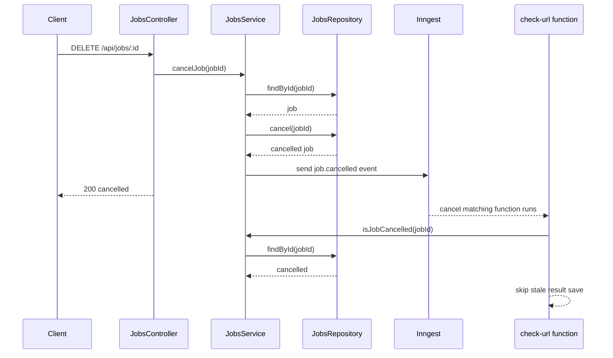

# Cancellation Flow

```mermaid
sequenceDiagram
  participant Client
  participant API as JobsController
  participant Service as JobsService
  participant Repo as JobsRepository
  participant Inngest
  participant Fn as check-url function

  Client->>API: DELETE /api/jobs/:id
  API->>Service: cancelJob(jobId)

  Service->>Repo: findById(jobId)
  Repo-->>Service: job

  Service->>Repo: cancel(jobId)
  Repo-->>Service: cancelled job

  Service->>Inngest: send job.cancelled event
  API-->>Client: 200 cancelled

  Inngest-->>Fn: cancel matching function runs

  Fn->>Service: isJobCancelled(jobId)
  Service->>Repo: findById(jobId)
  Repo-->>Service: cancelled

  Fn-->>Fn: skip stale result save
```
