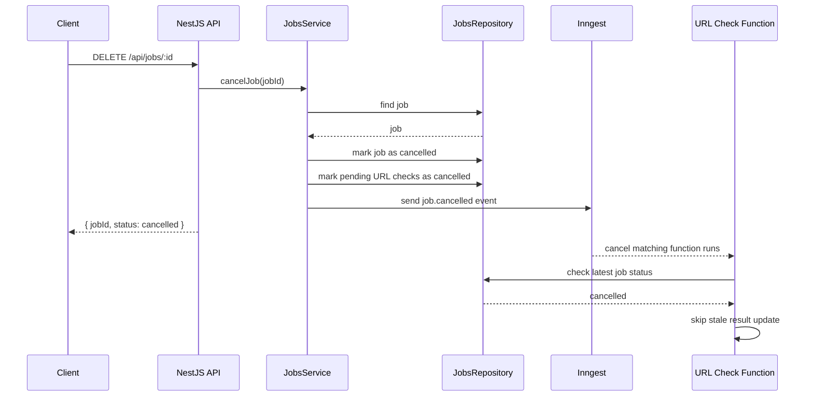

# Cancellation Flow Diagram

```mermaid
sequenceDiagram
  participant Client
  participant API as NestJS API
  participant Service as JobsService
  participant Repo as JobsRepository
  participant Inngest
  participant Fn as URL Check Function

  Client->>API: DELETE /api/jobs/:id
  API->>Service: cancelJob(jobId)

  Service->>Repo: find job
  Repo-->>Service: job

  Service->>Repo: mark job as cancelled
  Service->>Repo: mark pending URL checks as cancelled
  Service->>Inngest: send job.cancelled event

  API-->>Client: { jobId, status: cancelled }

  Inngest-->>Fn: cancel matching function runs

  Fn->>Repo: check latest job status
  Repo-->>Fn: cancelled

  Fn->>Fn: skip stale result update
```